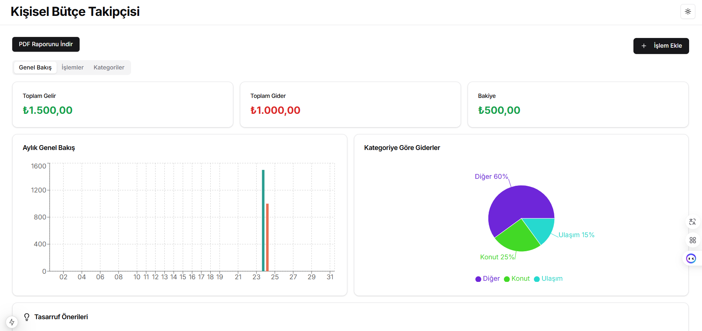
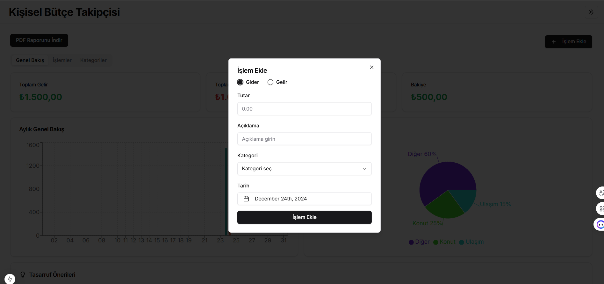
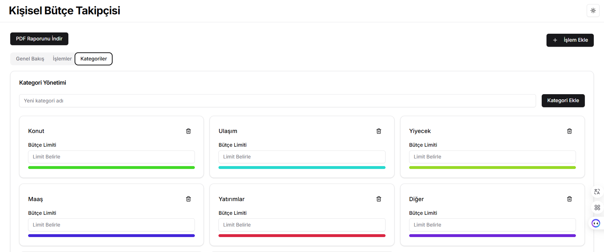

# Personal Budget Tracker

Personal Budget Tracker is a web application designed to help users track their income, expenses, and overall financial health. It allows users to categorize transactions, view detailed insights, and manage their budget effectively.


## Features

- Add and delete transactions (income or expense).
- Categorize transactions (e.g., food, rent, entertainment).
- View transactions sorted by date.
- Display total income, expenses, and balance.
- Responsive design for mobile and desktop.

## Tech Stack

- **Frontend:** Next.js, Tailwind CSS, Date-fns
- **Icons:** Lucide-react
- **State Management:** Context API
- **Data Storage:** Local Storage
- **Data Visualization:** Recharts

## Screenshots

### Dashboard


_The dashboard displays the total balance, income, and expenses summary._
_Interactive charts provide a clear view of your financial trends._

### Add Transaction Page


_Users can add income or expense transactions with details like amount, date, and category._

### Categories


_Users can view, add, or manage their categories, such as income and expense types._  
_Additionally, users can set a spending limit for each category to manage their budget effectively._

### Transaction


_The transaction list displays all user transactions with details like date, type, description, category, and amount._  
_Users can delete specific transactions if needed._


## How to Run the Project

1. Clone the repository:
   ```bash
   git clone https://github.com/MOHAMED-ALI-YOUSSOUF/personal-budget-tracker.git


2. Navigate to the project folder:
    ```bash
   cd personal-budget-tracker
4. Install dependencies:
    ```bash
   npm install
6. Getting Started

First, run the development server:

```bash
npm run dev
# or
yarn dev
# or
pnpm dev
# or
bun dev
```
5. Open your browser and navigate to: http://localhost:3000

## Live Demo
Check out the live demo [here]( https://personal-budget-tracker-bay.vercel.app/).

## Contact
Created by [Mohamed Ali Youssouf](https://mohamed-ali-youssouf.com) - Feel free to reach out!


